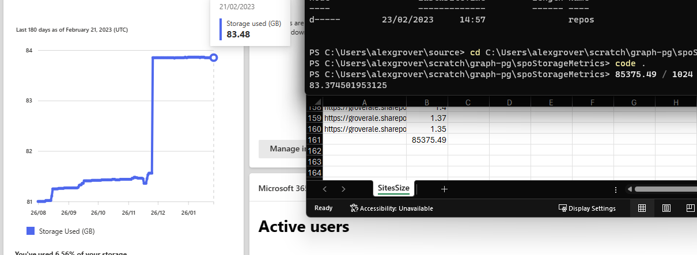

## List Site Storage

This script will generate a CSV file listing site urls with total storage.

It uses MSGraph and requires an app registration with the application permission `Sites.Read.All`

The sample uses a certificate to authenticate with MSGraph. The certificate should be generated on the device that will run the script

``` powershell

$certname = "spometrics"
$cert = New-SelfSignedCertificate -Subject "CN=$certname" -CertStoreLocation "Cert:\CurrentUser\My" -KeyExportPolicy Exportable -KeySpec Signature -KeyLength 2048 -KeyAlgorithm RSA -HashAlgorithm SHA256
Export-Certificate -Cert $cert -FilePath "C:\Users\alexgrover\$certname.cer"   ## Specify your preferred location


## Note the thumbprint
$cert.Thumbprint
```

Quite accurate during testing



